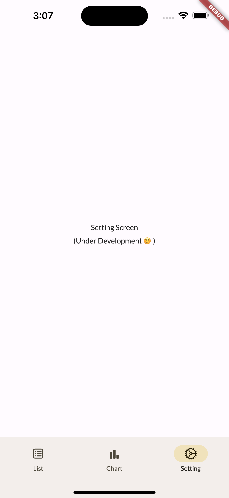

# Money Manager

## Requirement

Gatau lah, cuma pake flutter.

Dependencies-nya liat `pubspec.yaml` aja lah ya :)

## Screenshot

<pre>
           
</pre>

## FAQ?

- Where is test code? (Unit Test, UI Test, Integration Test)
  > Real men test in _**Production**_
- Nambah fitur gimana bang Messi?

  > <a href="https://github.com/arganaphang/manaze/issues/new" target="_blank">Klik ini aja kalau mau request fitur atau lapor bug</a> \*kalau bug boleh dikasih tau steps reproduce nya 🙏

- Ini _**FREE**_ kah om?

  > HELL YEAH dude

  - gua benci app ginian yang banyak ads nya, jadi gua buat 1 completely f\*cking free
  - Nanti donate aja kalau mau support, atau langsung kontak creator/developernya aza~~~)
